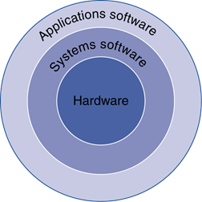
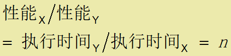
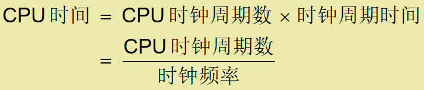
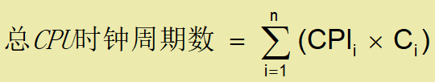
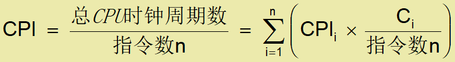
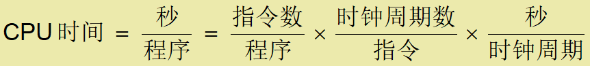
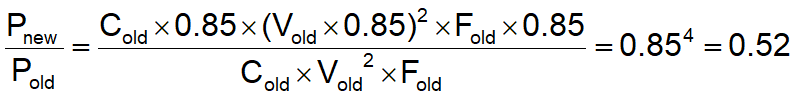
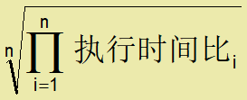
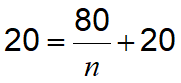
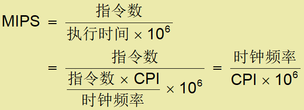

# chapter 1

计算机技术的发展以摩尔定律为基础

## 计算机的类型

个人计算机：

1. 通用, 多样软件支持
2. 强调能提供良好的性能、低廉的价格

服务器：

1. 基于网络
2. 大容量、高性能和可靠性
3. 功能和价格从低端到高端伸缩范围大

超级计算机:

1. 主用于高端科学和工程计算
2. 代表了最高的计算能力，占市场比例小

嵌入式计算机:

1. 隐藏作为系统的组件
2. 功耗、成本和性能受限

## 后PC时代：

1. 个人移动设备PMD：连接到网络上的小型无线设备
2. 云计算：在网络上提供服务的在服务器集群，运营商根据应用需求出租不同数量的服务器。

## **理解程序性能**

1. 算法:决定了源码级语句的数量和I/O操作的数量

2. 编程语言、编译器和体系结构:决定了每条源码级语句对应的计算机指令数量

3. 处理器和存储系统:决定了指令的执行速度

4. I/O 系统（包括操作系统）:决定了I/O 操作的执行速度

## 8个伟大思想

1. 面向摩尔定律的设计
2. 使用抽象简化设计
3. 加速大概率事件
4. 通过并行提高性能
5. 通过流水线提高性能
6. 通过预测提高性能
7. 存储器层次
8. 通过冗余提高可靠性

## **程序的层次**

1. 应用软件：用高级语言编写

2. 系统软件：
   1. 编译程序: 将高级语言程序翻译为机器语言程序
   2. 操作系统: 为用户提供各种服务和监控功能
      1. 处理输入/输出
      2. 管理内存和外存
      3. 调度任务  & 资源共享

3. 硬件：处理器,内存, I/O 控制器

## **微处理器内部**(CPU)

1. 数据通路: 处理器中执行数据操作的部分

2. 控制器: 处理器中根据程序的指令指挥数据通路、存储器和I/O设备的部分。

3. 缓存：是一种小而快的静态随机访问存储器。

## **抽象**

1. 利用抽象帮助我们简化复杂问题：隐藏低层细节
2. 指令集体系结构(ISA)：是底层硬件和软件之间接口的抽象
3. 应用二进制接口（ABI）：是底层指令集和系统功能接口的抽象
4. 实现：细节隐藏于接口之后

## **安全数据存储**

1. 易失性内存：断电后，所有数据和指令丢失

2. 非易失性辅存：
   1. 磁盘
   2. 闪存
   3. 光盘 (CDROM, DVD)

## **电子技术趋势**

1. 容量和性能不断增加

2. 成本不断降低

## **响应时间和吞吐率**

1. 响应时间 （也叫执行时间）：计算机完成某任务所需的总时间。

2. 吞吐率 （也叫带宽）：单位时间内完成的任务数

3. 如何正向影响响应时间和吞吐率
   1. 将处理器更换为更高速的型号?
   2. 增加多个处理器分别处理独立的任务?

## **相对性能**

定义：性能 = 1/执行时间

## **度量执行时间**

1. 运行时间Elapsed time
   1. 总的响应时间，包括所有方面
   2. 处理, I/O操作, OS 开销, 空闲时间
   3. 决定了系统的性能

2. CPU 时间
   1. 执行某一任务在CPU上所花费的时间
   2. 折掉 I/O 和其它任务共享所花费的时间
   3. 包括**用户** **CPU** **时间** 和**系统** **CPU** **时间**
   4. 不同程序受CPU性能和系统性能的不同影响

## **CPU** **时间计算**

性能改进：Performance improved by

1. 减少时钟周期数
2. 提高时钟频率
3. 硬件设计者要经常面对时钟周期数和时钟频率之间的权衡

## **指令数和** **CPI**

1. 一个程序的指令数：取决于程序, ISA 和编程器

2. 平均每条指令的时钟周期数
   1. 由 CPU 硬件确定
   2. 如果不同指令的CPI不同，那么平均CPI受指令组合的影响

## **更复杂的**CPI

如果一个有n条指令的指令序列有不同类型指令，各需不同的时钟周期数，那么

Weighted average CPI：

## **性能度量**

程序的性能依赖于：

1. 算法: 影响指令数,可能的 CPI

2. 编程语言: 影响指令数, CPI

3. 编译程序: 影响指令数, CPI

4. 指令集体系结构: 影响指令数, CPI, 时钟频率

## **功耗**

基于 CMOS 集成电路技术的每个晶体管的功耗

## **降低功耗**

假设开发一种新 CPU ，其

1. 负载电容是旧CPU的85%
2. 电压降低了15% ，频率也降低了15% ，则

功耗墙：

1. 我们不能进一步减少电压
2. 我们不能再散发更多的热量

## **单核处理器的性能**

受到功耗、指令级并行程度和存储器长延迟时间的限制

## **多处理器**

1. 多核微处理器：每个芯片中有多个处理器

2. 需要显式并行程序
   1. 与指令级并行的比较
      1. 硬件一次执行多条指令
      2. 为程序员提供编程接口，以隐藏底层细节
   2. 程序员编写显式并行程序难：
      1. 并行编程以提高性能为目的，增加了编程难度
      2. 要解决任务调度、负载均衡问题
      3. 优化通信与同步问题

## **SPEC CPU** **基准测试程序**

用于比较和测量计算机性能的程序

使用典型的实际工作负载

SPEC CPU2006

1. 运行一个基准测试程序的执行时间：I/O量微，可以忽略, 主要是CPU性能

2. 执行时间相对于参考机进行标准化：计算几何平均值的公式

## **陷阱**: Amdahl**定律**

误认为：在改进计算机的某个方面时期望总性能的提高与改进大小成正比。

例子: 一个程序运行需100秒，乘法操作占80秒，若把程序运行速度提高到5倍，乘法操作的速度该改进多少？

不可能。

推论: 加速大概率事件。

## **谬误**: **利用率低的计算机功耗低**

CPU利用率大多数时间在 10% – 50% 之间

i7功耗：

1. 100% 负载: 258W

2. 50% 负载: 170W (66%)

3. 10% 负载: 121W (47%)

## **陷阱**: MIPS **作为性能指标**

nMIPS: 每秒百万条指令

无法解释：

1. 计算机之间指令集的差异

2. 指令之间复杂性的差异

在给定的CPU上程序间的CPI 是变化的

## 总结：

1. 成本/性能不断改进：由于底层技术的发展
2. 分层抽象：在硬件和软件方面
3. 指令集体系结构：是硬件和底层软件之间的接口
4. 执行时间: 最佳性能度量指标
5. 功耗是一个受限的因素：使用并行化提升性能是发展趋势