# Chapter 2：

## **指令集**

1. 一个计算机的指令表

2. 不同的计算机架构具有不同的指令集，大部分都一样

3. 早期计算机的指令集非常简单，简化实现

4. 许多现代计算机的指令集依然简单

## **寄存器操作**

1. 算术运算指令使用寄存器操作数

2. MIPS 有 32 × 32-bit 寄存器文件
   1. 用于频繁读取的数据
   2. 序号为0-31
   3. 32位的数据称为“word”

3. 汇编器名称为：
   1. $t0, $t1, …, $t9：  临时变量 
   2. $s0, $s1, …, $s7： 存变量
   3. $zero, $sp, $fp…

4. 主存: 106的地址

## **内存操作数**

1. 主存用于组合数据
   1. 数组，结构体，动态数据
2. 应用于算术运算
   1. 从内存往寄存器装载数据
   2. 从寄存器往内存存储数据
3. 内存以byte编址
   1. 每个地址标识一个8-bit字节的空间
4. 字（word）在内存中是对齐的
   1. 地址必须是4的倍数
5. MIPS 使用大端方式
   1. 字的最小地址表示其最高有效位。
   2. c.f. 小端:最小地址表示最低有效位

## **内存操作示例**

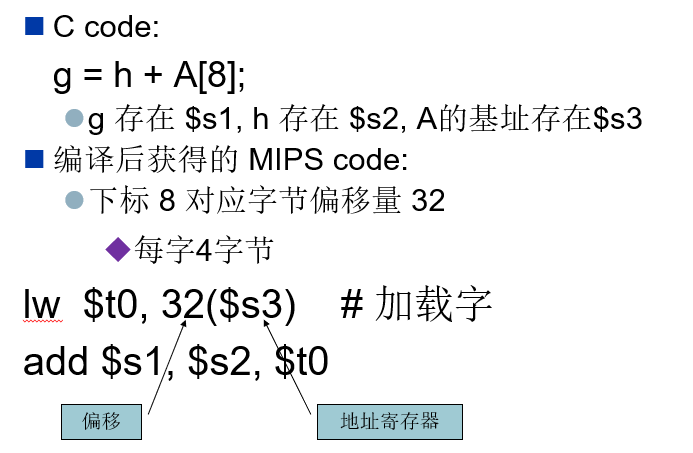

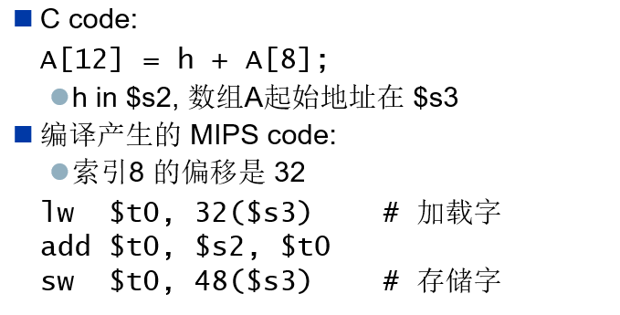

## **寄存器** **vs.**内存

1. 寄存器存取数据比内存快
2. 操作内存数据需要加载和存入两个操作
   1. 需要执行更多指令
3. 编译器需要尽可能多地使用寄存器变量
   1. 仅将不频繁使用的变量存入内存
   2. 寄存器优化非常重要

## **立即操作数**

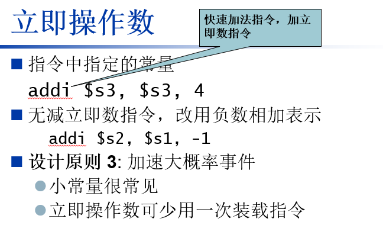

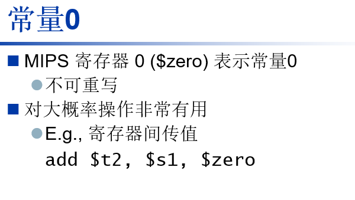

## **MIPS R-**型指令

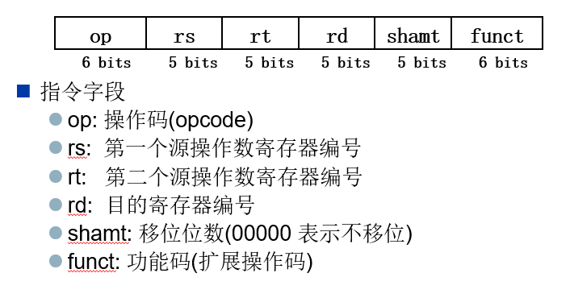

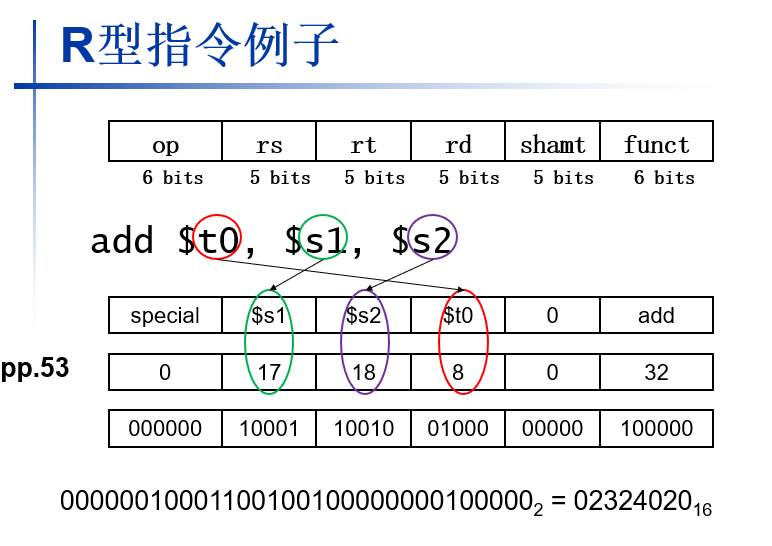

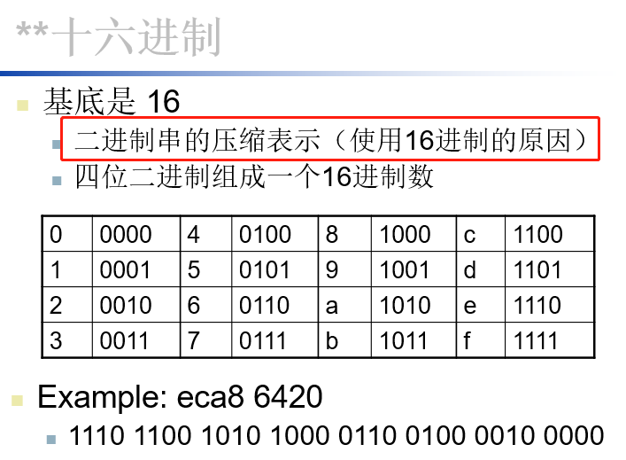

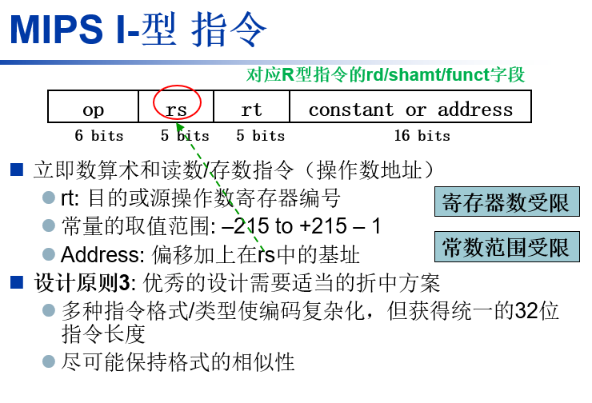

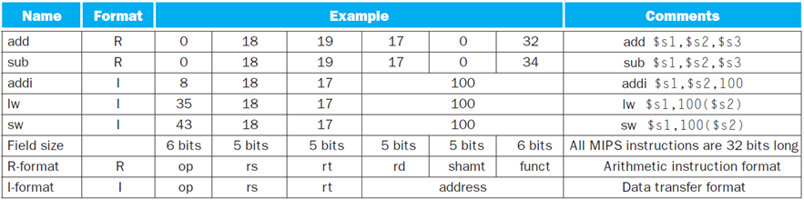

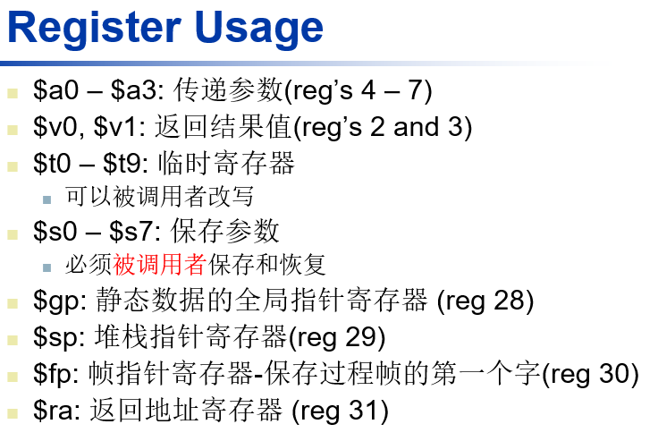

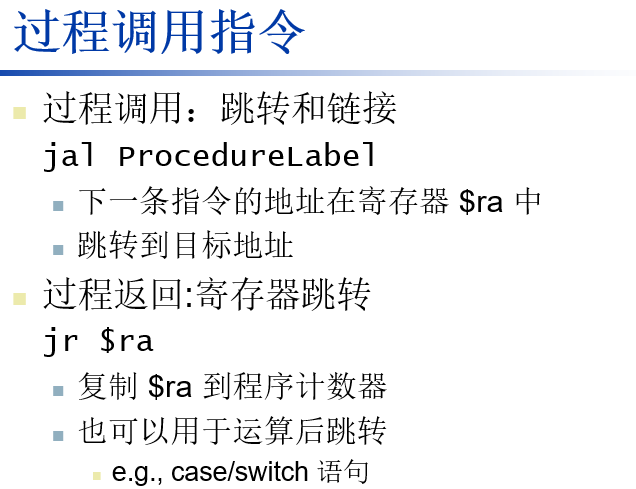

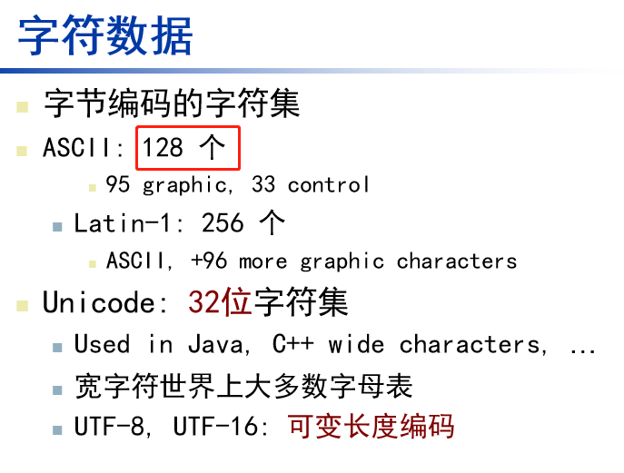

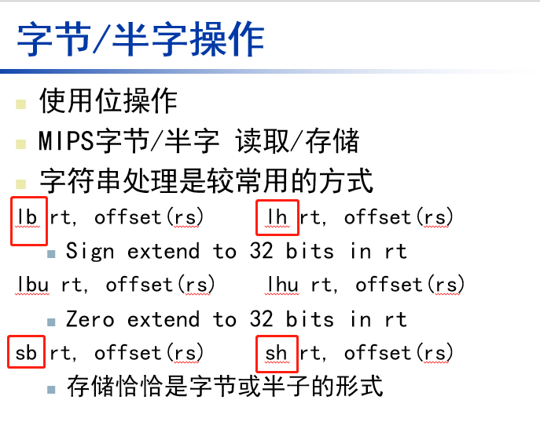

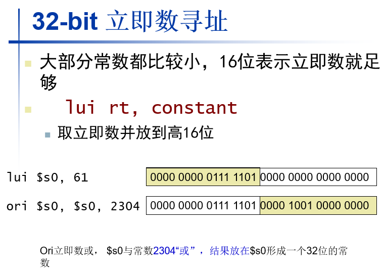

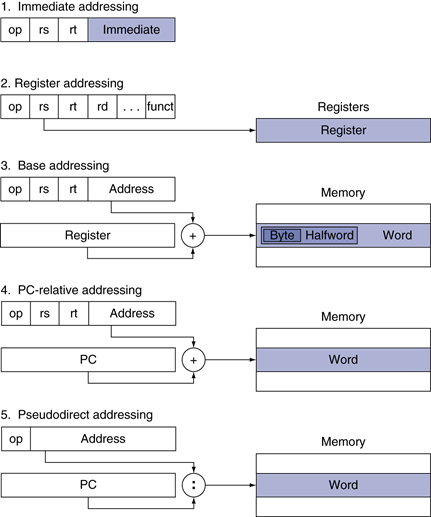

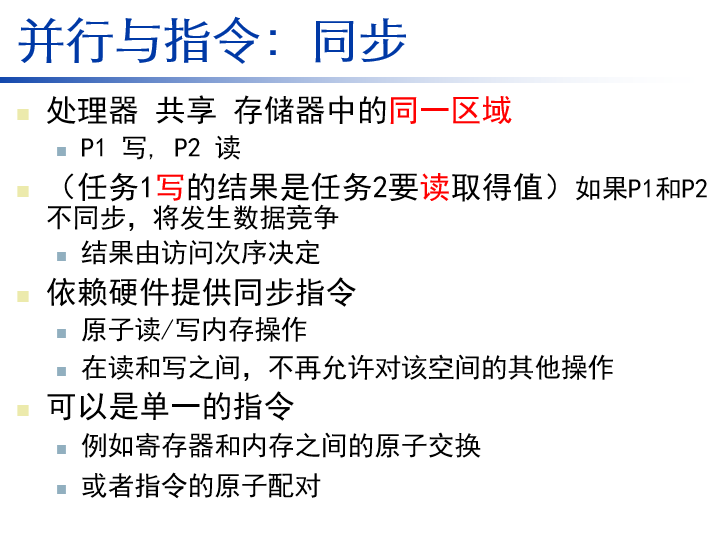

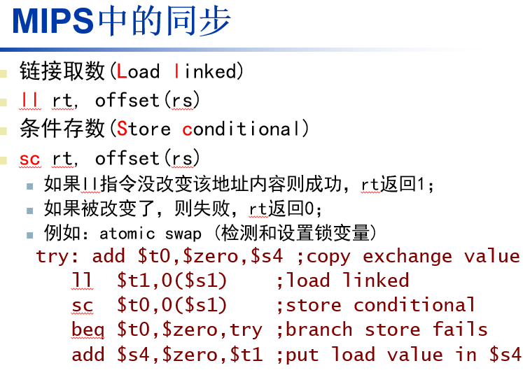

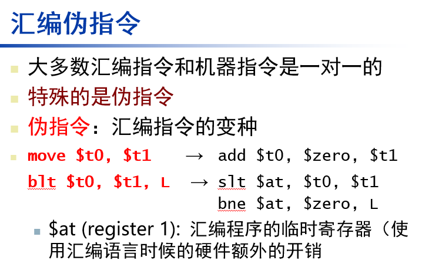

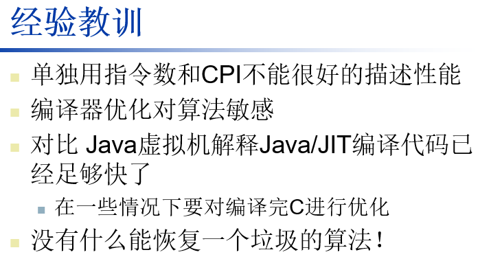

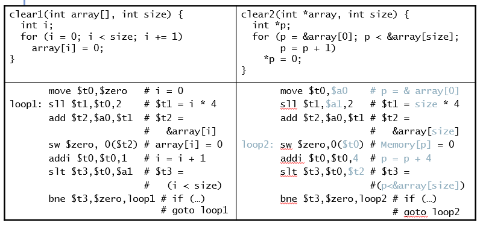

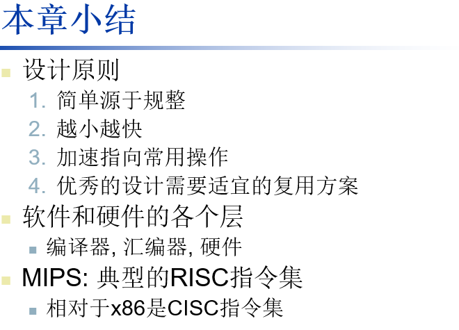

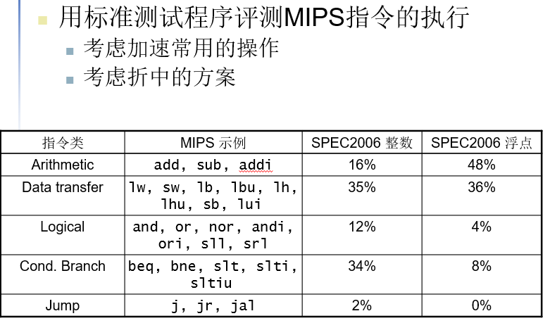